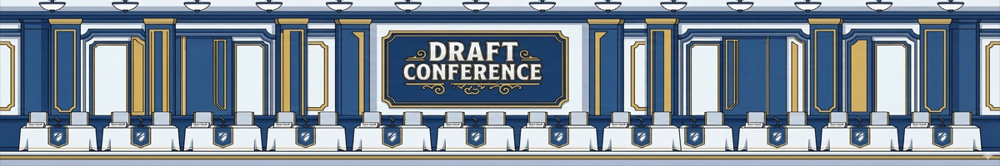

# 配布パッケージ包含漏れ監査レポート

監査日: 2026-07-16
対象: `release/manifest.json` v1.11、`release/package-release.ps1`、`release/verify-package.ps1`

## 結論サマリ

| 判定 | 件数 | 結論 |
|---|---:|---|
| 実在する実行時参照先が配布に含まれない（包含漏れ） | **0** | manifest の追記は不要 |
| コードから参照されるが実在しない（幽霊参照） | **1** | ドラフト交渉画面のバナー相対パスに誤り |
| manifest 記載だが実在しない | **0** | パッケージ作成を止める記載なし |

`package-release.ps1` は `sourceFiles` と `rootFiles` を個別コピーし、`assetDirectories` の `image/` と `bgm/` を再帰コピーする。そのため画像・音声は manifest に個別ファイル名がなくても配布に含まれる。機械監査で解決できた参照先は重複除去後 692 ファイルで、691 ファイルは実在かつ配布対象、1 ファイルは幽霊参照だった。

## 判定マトリクス

| 参照先の区分 | 解決したファイル数 | 実在 | manifest／コピー規則で包含 | 判定 |
|---|---:|---:|---:|---|
| `image/` | 630 | 630 | 630 | OK |
| `bgm/` | 36 | 36 | 36 | OK |
| `src/` の HTML / JS / CSS と同階層参照 | 26 | 25 | 25 | 幽霊参照 1 |
| **合計** | **692** | **691** | **691** | **包含漏れ 0 / 幽霊参照 1** |

manifest の逆方向検査では、`sourceFiles` 26件、`rootFiles` 3件、`assetDirectories` 2件がすべて実在した。また `src/` 直下に実在する `.js` / `.css` / `.html` はすべて `sourceFiles` に記載済みで、未記載ファイルはなかった。

## 包含漏れ一覧

該当なし。

## 参照されているが実在しないファイル

| コード上の参照 | 参照元 | ブラウザーが解決する場所 | 影響 |
|---|---|---|---|
| `image/draft-header.webp` | `src/ui-render.js:5327` | `src/image/draft-header.webp`（不存在） | ドラフト交渉画面のヘッダーバナーが `onerror` で非表示になる。画面操作自体は継続できるが、意図したビジュアルが欠落する。 |

意図されたと思われる実ファイル `image/draft-header.webp` は存在し、`image/` の再帰コピーによって配布にも含まれる。したがって manifest の問題ではなく、コード側の相対パスを `../image/draft-header.webp` に直すべき箇所である。本監査では既存コードを変更していない。

## 推奨する manifest 追記行

**なし。** 現行の `assetDirectories` に次の指定があるため、実在する画像・音声参照はすでに包含される。

```json
"assetDirectories": [
  "image",
  "bgm"
]
```

幽霊参照は manifest 追記では解消しない。レビュー後にコードを修正する場合の置換候補は次のとおり。

```html

```

## 重点確認結果

| 対象 | 確認結果 |
|---|---|
| `image/award-frame-*` | 現在の実ファイルは `award-frame-b.png.webp` 〜 `award-frame-g.png.webp` の **6枚**（7枚ではない）。本番コードからの参照は検出されなかったが、6枚とも `image/` 再帰コピーで配布される。 |
| `portrait-map.js` | 現在の作業ツリーには存在せず、本番コードからの読み込みもない。マッピングは `src/data.js` の `PORTRAIT` / `PORTRAIT_OVR_VARIANT` に統合済みで、同ファイルは manifest 記載済み。manifest へ `portrait-map.js` を追加してはいけない。 |
| `src/coach-lines.js` | 実在し、`sourceFiles` に記載済み。`src/index.html` からも読み込まれる。 |
| `image/org/org-*.png` | NPC団体12枚とプレイヤー団体10枚、計22枚が実在。団体名プールとアイコン選択肢を展開した全参照が実在し、全て配布対象。 |
| `image/npc/` | `face_kuroda_s.png` / `upper_kuroda_s.webp` の2枚が辞書展開結果と一致し、配布対象。 |
| `image/shachoshitsu/` | 11ファイルが実在。季節ID（spring / summer / autumn / winter）を展開した背景4枚を含め、コード参照先は全て実在・配布対象。 |

## 機械監査の手法と除外基準

一時 Node.js スクリプトで、`src/` 直下の本番 `.js` / `.html` を走査し、コメントを字句状態で除去してから、画像・音声・HTML・CSS・JS の文字列参照を抽出した。相対パスは参照元を基準に正規化し、`PORTRAIT`、`PORTRAIT_OVR_VARIANT`、`NPC_PORTRAIT`、`COACH_PORTRAIT`、団体名プール、プレイヤーアイコン範囲、社長室の季節ID、`SHIELD_VARIANTS` を実ファイル名へ展開した。得られた各パスをファイルシステムの実在集合と、manifest の個別ファイルおよび `assetDirectories` の再帰包含集合へ突き合わせ、逆方向に manifest 全項目の実在も検査した。

コメント内の仕様書・モックアップ名、`test/` / `archive/` / `docs/` 内だけの参照、`data:` URI、セーブ用 `.json` 名、ユーザーデータ由来の任意URLは実行時ローカル資産ではないため除外した。また `src/ui-common.js:8439` の `image/upper/${fighterId}.webp` は、正規の `src/index.html` が先に `src/data.js` を読み込み、常に `getUpperUrl()` を使う場合にのみ回避される防御的フォールバックであるため、通常配布の幽霊参照件数からは除外した（依存ロード失敗時のフォールバック自体は有効な画像名にならない点に注意）。
